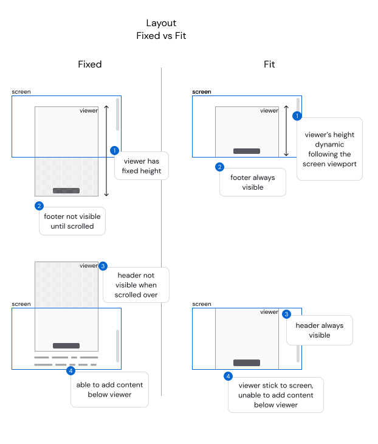

# Pena

> PrivyID's Official Client Integration SDK Library for signing.

## Installation

**NPM**

```bash
npm install --save @privyid/pena
```

**Yarn**
```bash
yarn add @privyid/pena
```

## Usage

```js
import Pena from '@privyid/pena'

Pena.openDoc({
  container: '#app',                                // Target container
  url      : 'https://sign.privy.id/doc/xxxxxxx',   // Document URL
  lang     : 'en',                                  // Set language, 'en' or 'id'
  layout   : 'fixed',                               // Set layout mode, 'fixed' or 'fit'
  signature: {
    x    : 100,
    y    : 200,
    page : 1,
    fixed: false,
  },
  onAfterAction: (data) => {
    // Do something after action (sign, review, etc) done
    if (data.action === 'sign') {
      window.alert('Signed')
    }
  },
})
```

## Options

| Name            | Type             |   Default   | Description                                                                                                                                  |
|-----------------|------------------|:-----------:|----------------------------------------------------------------------------------------------------------------------------------------------|
| `url`           | string           |      -      | **(Required)** Document's url                                                                                                                |
| `container`     | string           |   `.pena`   | Target's query selector                                                                                                                      |
| `lang`          | string           |    `en`     | Set language, valid value is `en` or `id`                                                                                                    |
| `layout`        | string           |   `fixed`   | Set layout mode, valid value is `fixed` or `fit`, see the [different][different]                                                             |
| `visibility`    | boolean          |   `true`    | Set signature visibility                                                                                                                     |
| `privyId`       | string           |      -      | Set recipient's privyId                                                                                                                      |
| `signature`     | object           |      -      | Set signature placement<br/> <strong>(Deprecated)</strong> use API to set placement when upload the document                                 |
| ├ `x`           | number           |      -      | X Coordinate                                                                                                                                 |
| ├ `y`           | number           |      -      | Y Coordinate                                                                                                                                 |
| ├ `page`        | number           |      -      | Target page                                                                                                                                  |
| └ `fixed`       | boolean          |   `false`   | Disabled signature for moving                                                                                                                |
| `debug`         | boolean          |   `false`   | Enable debug mode                                                                                                                            |
| `ratio`         | number           | `210 / 297` | Ratio size **(Layout `fixed` only)**                                                                                                         |
| `needScrollTo`  | number \| string |      -      | Force user to scroll to target page before doing an action (sign,review,etc). Valid value is a number, or set `last` to target the last page |
| `onAfterAction` | function         |      -      | After action hook                                                                                                                            |

## Layout Fixed vs Fit

Pena has 2 layout modes: `fixed` and `fit`. Layout `fit` is very good for UX but may not suit
on your web UI. However, `fixed` more easy to use, and better suit to any web UI, but sacrifice a little UX (dragging, scrolling on mobile).

If you have only Pena as a content in your page. We **recommended** to use `fit` layout.



## Using CDN

Not very recommended, but you can also use Pena with CDN, just add this in your HTML:

```html
<script src="https://cdn.jsdelivr.net/npm/@privyid/pena"></script>
```

## Migrate from [privy-sdk](https://www.npmjs.com/package/privy-sdk)

1. Change package from `privy-sdk` to `@privyid/pena`
```js
import Privy from 'privy-sdk'

// Change to

import Pena from '@privyid/pena'
```
2. Parameter `doctoken` is changed to fullpath `url`.
```js
Privy.openDoc('YOUR_DOC_TOKEN')

// Change to

Pena.openDoc({
  url: 'https://sign.privy.id/doc/YOUR_DOC_TOKEN',
})
```
3. Option `dev` is removed, environment between dev or production is follow the base url.
    - **production**: `https://sign.privy.id/`
    - **development**: `https://stg-sign.privy.id/`
4. Hook `.on('after-action')`, `.on('after-sign')` and `.on('after-review')` is unified into single option `onAfterAction`
```js
Privy.openDoc(/* .... */)
  .on('after-sign', () => { })
  .on('after-review', () => { })
  .on('after-action', () => { })

// Change to

Pena.openDoc({
  // ...
  onAfterAction (data) {
    // Do something after any action

    if (data.action === 'sign') {
      // Do something after sign only
    }

    if (data.action === 'review') {
      // Do something after review only
    }
  },
  // ...
})
```
5. Pena introduce new layout mode `fixed`, which used as the default. If you prefer to keep old behaviour. Set layout to `fit`.
```js
Pena.openDoc({
  layout: 'fit',
})
```

## License

This project is licensed under the MIT License - see the [LICENSE](/LICENSE) file for details

[different]: #layout-fixed-vs-fit
